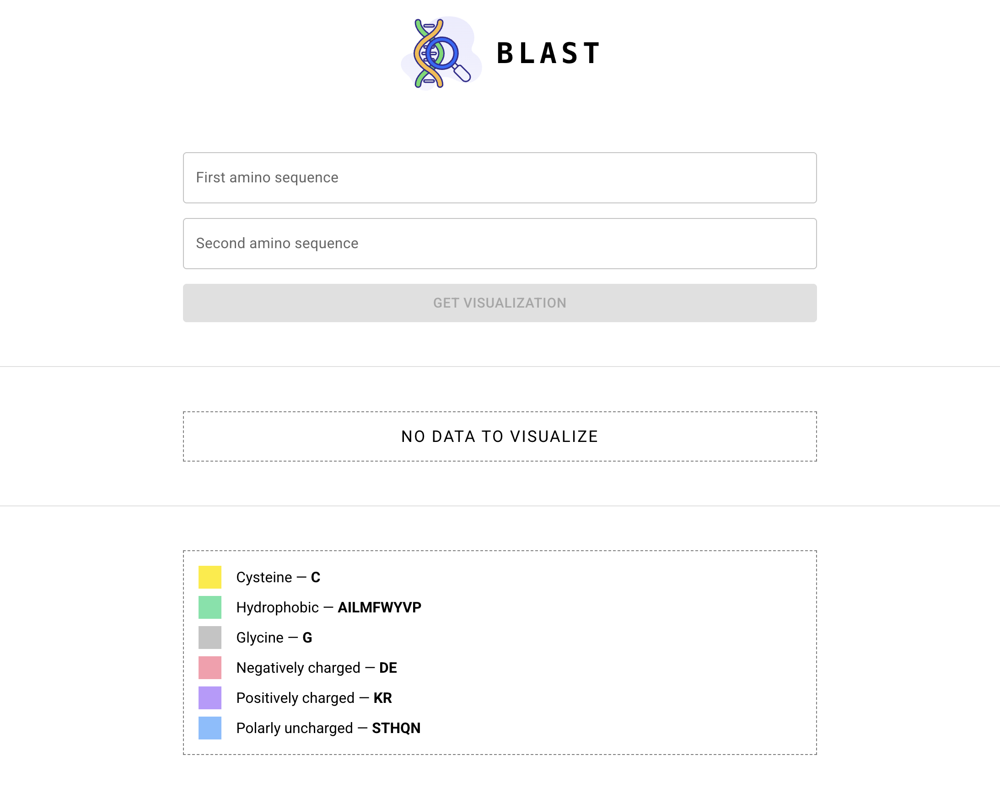
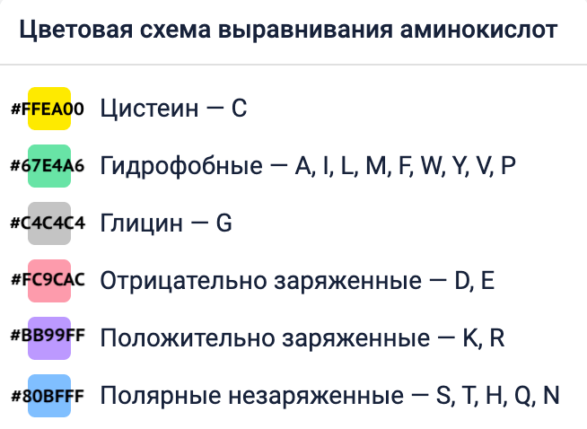

# BLAST

[BLAST](https://ru.wikipedia.org/wiki/BLAST) (англ. Basic Local Alignment Search Tool) — это зачаток инструмента для визуализации выравнивания аминокислотных последовательностей.

## Как пользоваться

1. Оба поля обязательны для заполнения и могут принимать только латинские буквы аминокислот (A, R, N, D, C, E, Q, G, H, I, L, K, M, F, P, S, T, W, Y, V) и символ `-`. Также оба значения должны быть одинаковыми по длине. Пример: аминокислотная последовательность (гемоглобин из мангуста) в буквенном представлении:
   `VLSPADKTNIKASWEKIGSHGGEYGAEALERTFLCFPTTKTYFPHFDLSHGSAQVKAHGKKVADALTNAVGHLDDLPGALSALSDLHAYKLRVDPVNFKLLSHCLLVTLASHHPAEFT`

2. После валидного заполнения формы, кнопка для получения визуализации последовательностей станет доступна.

3. При визуализации в первой введенной последовательности каждая буква окрашивается фоном в свой цвет в соответствии со свойствами аминокислот 
    
   Во второй последовательности фоном выделены только те буквы, которые отличаются от соответствующей по индексу буквы в первой последовательности.  Для удобства сравнения строки (или части строк, если последовательность длинная) всегда располагаются друг под другом.

4. На странице сохранен встроенный поиск по части последовательности (при помощи cmd+F или ctrl+F).

5. Также есть возможность копирования: при выделении мышкой части последовательности она вставится в буфер обмена и вы получите соответствующее всплывающее уведомление о том, что последовательность скопирована. Уведомление пропадет через 1 секунду после появления.

## Технологии

## Планы по расширению функционала
[ISSUES](https://github.com/anvass/blast/issues)
